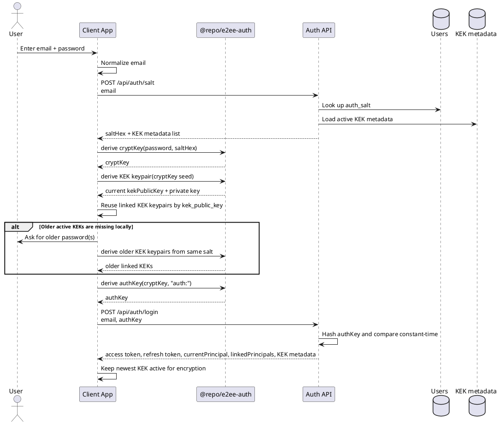

# Registration And Login

This page breaks the authentication handshake into the two client journeys that
matter operationally: first-time registration and repeat login with a stored
salt.

## Registration flow

Registration happens in this order:

1. The user enters an email address and password in the client.
2. The app normalizes the email by trimming whitespace and lowercasing it.
3. The app generates a random 16-byte salt locally and hex-encodes it.
4. The app derives a 64-byte `cryptKey` from the password and salt with Argon2id.
5. The app derives an `authKey` from `cryptKey` with HKDF-SHA512 using the `auth:` context.
6. The app derives a deterministic ML-KEM-768 KEK keypair from `cryptKey` and uses the public key as `kekPublicKey`.
7. The app sends `email`, `authKey`, `saltHex`, and `kekPublicKey` to `POST /api/auth/register`.
8. The backend stores:
   - the normalized email
   - a SHA-512 hash of `authKey`
   - the user salt as `auth_salt`
   - one initial `kek_metadata` row with the client-derived public key as `kek_public_key` and `kek_epoch_version = 1`
9. The backend returns an access token, a refresh token, the owner user record, the current principal, the linked principals, and the active KEK metadata list.

```plantuml format="svg_inline" alt="Registration sequence" title="Registration sequence"
@startuml
skinparam shadowing false

actor User
participant "Client App" as Client
participant "@repo/e2ee-auth" as Shared
participant "Auth API" as Api
database "Users" as Users
database "KEK metadata" as KekMeta

User -> Client: Enter email + password
Client -> Client: Normalize email
Client -> Client: Generate random saltHex
Client -> Shared: derive cryptKey(password, saltHex)
Shared --> Client: cryptKey
Client -> Shared: derive authKey(cryptKey, "auth:")
Shared --> Client: authKey
Client -> Shared: derive KEK keypair(cryptKey seed)
Shared --> Client: kekPublicKey = publicKey
Client -> Api: POST /api/auth/register\nemail, authKey, saltHex, kekPublicKey
Api -> Api: Hash authKey with SHA-512
Api -> Users: Store email, auth_key_hash, auth_salt
Api -> KekMeta: Insert kek_public_key, kek_epoch_version = 1
Api --> Client: access token, refresh token, user, currentPrincipal, linkedPrincipals, KEK metadata
Client -> Client: Link KEK keypair locally by kek_public_key
@enduml
```

## Login flow

Login is a two-step handshake because the client needs the stored salt before it
can derive the same `authKey` again:

1. The user enters email and password.
2. The app normalizes the email.
3. The app sends the email to `POST /api/auth/salt`.
4. The backend looks up the user and returns the stored `saltHex` plus all active `kek_metadata` rows for that user.
5. The app derives the `cryptKey` from `password + saltHex` with Argon2id.
6. The app derives the current KEK keypair from that `cryptKey`, links it to the newest `kek_epoch_version`, and reuses any previously stored older KEK keypairs by `kek_public_key`.
7. If older active KEKs exist but are not linked locally yet, the app asks for the matching older passwords during login and derives those older KEK keypairs locally with the same salt.
8. The app derives `authKey` from `cryptKey` with HKDF-SHA512 using the `auth:` context.
9. The app sends `email` and `authKey` to `POST /api/auth/login`.
10. The backend hashes the received `authKey` with SHA-512 and compares it in constant time with the stored hash.
11. If verification succeeds, the backend issues access and refresh JWTs and returns the current principal plus the current KEK metadata and linked principal list.
12. The mobile client persists that session locally and later calls `POST /api/auth/refresh` to replace expired access tokens without re-deriving KEKs.



## Why the split handshake exists

- Registration can choose a fresh random salt locally because no stored state exists yet.
- Login cannot derive `authKey` or confirm the active KEK public key until the client retrieves the server-side copy of that same salt.
- The backend only needs a verifier for the derived `authKey`, not the password or `cryptKey`.
- The returned KEK metadata and linked-principal list let the client decide whether old ciphertext still depends on older password epochs, whether its locally derived public key matches the newest `kek_public_key`, and which recipients need wrapped DEKs on the next write.